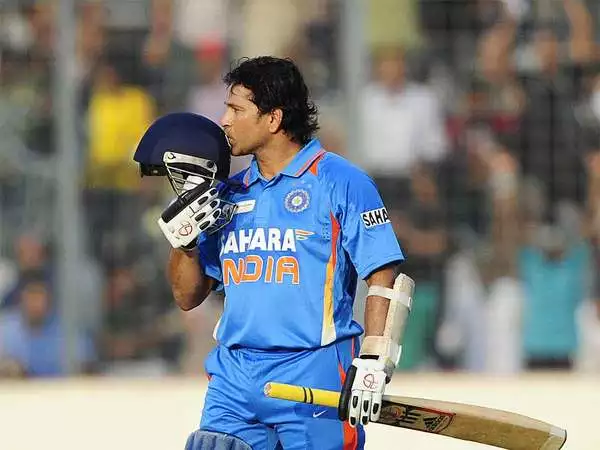

# 🧑‍💼 About Me

Hello!
I’m **Ramachandran Nellaiyappan**, a passionate and results-driven Senior Web Developer with 12 years of experience in
Java and full-stack development.
I specialize in creating static and dynamic web applications.

Expertise in **Java, Spring Boot, Angular, CI/CD automation, microservices, and security best practices**. Passionate
about **developer productivity, automation, and open-source contributions**.

My goal is to **continue evolving as a developer** while embracing **cutting-edge technologies like AI, automation, and
cloud computing**. By staying up-to-date with the latest advancements, I aim to integrate **AI-driven automation,
security enhancements, and intelligent decision-making** into modern applications.

## 🧑‍💻 What I Do

✅ **Backend Development** - Developing scalable, secure, and high-performance REST APIs using Java, Spring Boot,
Hibernate,
and Microservices.

✅ **Application Architecture & Design** - Designing robust, scalable architectures to solve real-time business problems
with
best practices, design patterns, and domain-driven design (DDD).

✅ **Threat Modeling & Security** - Conducting threat modeling and penetration testing to identify vulnerabilities and
enhance application security.

✅ **Automation** - Implementing CI/CD pipelines and Integrating tools to improve developer productivity & code quality
like
OpenRewrite, Renovate, ensuring efficient and maintainable codebases.

✅ **Frontend Development** - Building dynamic, responsive UI applications with Angular, integrating seamlessly with
backend
systems.

✅ **Continuous Learning & Innovation** - Staying up to date with emerging technologies, experimenting with new
frameworks,
and adopting industry best practices to deliver cutting-edge solutions.

## 🎯 Highlights

**🏆 Oracle Certified Database Associate (OCA)** - Strong expertise in SQL, database design, and performance tuning.

**📚 Continuous Learner & Tech Enthusiast** - Exploring new technologies, frameworks, and methodologies to stay ahead
in the evolving tech landscape.

**🔍 Problem Solver & Critical Thinker** - Skilled at analyzing complex challenges, architecting efficient solutions, and
optimizing system performance.

**💡 Open Source Contributor & Enthusiast** - Passionate about contributing to open-source projects, improving developer
tooling, and adopting modern best practices.

**🎯 Passionate About Software Quality & Automation** - Strong advocate of code quality, CI/CD pipelines, DevSecOps, and
automated testing to enhance development efficiency.

**🤝 Mentor & Community Contributor** - Actively involved in knowledge sharing, technical blogs, mentoring junior
developers, and tech talks.

## 💖 Passions & Interests

🚀 Developer productivity, CICD and Automation

🛡️ Security & Best Practices in Java

🖥️ Serverless Architectures

🧠 Machine Learning & AI in Java

## 🌱 Hobby

When I’m not coding, you can find me:

- 🍳 Cooking up some delicious meals
- 📚 Reading about the latest trends in **AI** & **Tech**
- ♟️ Playing chess
- 🎮 Playing Video Games

## 🌟 My Inspiration

  

    
    <h3><a href="https://en.wikipedia.org/wiki/A._P._J._Abdul_Kalam" target="_blank">Dr. APJ Abdul Kalam</a></h3>
    <h6>Scientist and 11th President of India</h6>
    
"Dream, dream, dream. Dreams transform into thoughts, and thoughts result in action."

  

  

    
    <h3><a href="https://en.wikipedia.org/wiki/Sachin_Tendulkar" target="_blank">Sachin Tendulkar</a></h3>
    <h6>Indian former international cricketer</h6>
    
"People throw stones at you and you convert them into milestones."

  

