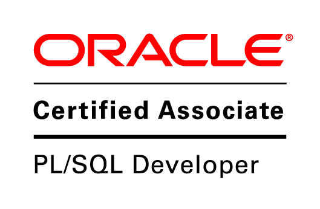

# 📄 Resume

[📄 Download as PDF](assets/documents/resume/Ramachandran%20Nellaiyappan.pdf){ .md-button .float-right }

    <h2 style="padding: 0; margin: 0">Ramachadran Nellaiyappan</h2>
    <h6 style="padding:0; margin: 0;">Senior Java Developer</h6>

Experienced Java Developer with 12+ years of expertise in building scalable web applications using Java, Spring,
Angular, and databases like Postgres and Oracle.
Skilled in agile methodologies.
Passionate about enhancing code
quality, driving productivity through innovative automation, and leading initiatives to improve development processes.

## 💼 Professional Experience

**Senior Software Developer** | [1&1 Mail & Media Development & Technology GmbH](https://www.mail-and-media.com/) |
January 2021 – Present (4+ Years)

- Leading projects for **Germany’s top e-mail provider** with 43M+ users
- Designed and developed applications using Java **Spring frameworks** and **Apache Wicket**
- Designing effective solutions for **real-time problems** and translating them into actionable, implementable plan
- Architected **microservices-based solutions**, ensuring modularity, reusability, and maintainability of the codebase
- Migrated legacy applications to **modern Java architectures**, reducing tech debt
- Integrated varies automation tools like **Renovate**, **Open-Rewrite** to reduce technical debt
- Strengthened security with **penetration testing** and **thread modeling**.
- Brainstormed and documented clear process and authored many How-To procedures, ensuring consistent processes,
  supporting team onboarding, and promoting best practices

**Assistant Consultant** | [Tata Consultancy Services](https://www.tcs.com/) | January 2013 – December 2020 (8 Years)

- Developed **enterprise-grade Java applications** for international clients
- Developed **RESTful web services** to integrate with internal and external third-party systems
- Received **Service & Commitment Awards** for major database migrations
- Designed and Migrated varies legacy applications to modern Java architectures, reducing technical debt and improving
  system security and performance
- Regularly conducting **security auditing** on varies projects and provides & receives feedback to improve application
  security
- Creating a detailed **delivery plan** and overseeing the progress to meet delivery point
- Facilitate delivery planning and stakeholder meetings
- Developed and optimized complex SQL queries, stored procedures, triggers, and views to read & write data efficiently
- Analyzed & implemented indexing strategies, partitioning, and query optimizations to improve database performance

## 💻 Technical Skills

- **Backend Languages & Frameworks**: Java, Spring Frameworks, SpringBoot, Hibernate, Kafka
- **Frontend Languages & Frameworks**: Apache Wicket(Java Server Side Rendering), Typescript, Angular, SAAS, Tailwind
  CSS
- **Databases**: Postgres, Oracle, MongoDB, SQL & PL/SQL
- **DevOps & Cloud**: Docker, Kubernetes, CI/CD, Git & GitLab, GitHub
- **Methodologies**:
    - Agile (Scrum)
    - Test-Driven Development (TDD for Development)
    - Behavioral-Driven Development (BDD for Testing)
- **Security Testing Tools & Methodologies**: STRIDE Thread Modeling, Penetration Testing, OWASP ZAP
- **Application Testing Languages & Frameworks**: Junit5, Serenity, Cucumber
- **Build Tools**: Maven, NPM
- **Documentation**: ASCIIDOC, MkDocs, OpenAPI with Swagger

## 🧠 Soft Skills

- Enthusiastic
- Continuous Learning & Innovation
- Leadership & Mentorship
- Effective Communication
- Problem-Solving & Decision-Making
- Productivity
- Planning & Prioritization

## 🛠️ Tools

- **Agile**: JIRA, Confluence, MIRO
- **Project Design**: Figma, PlantUML
- **Development**: IntelliJ IDEA, SonarQube, JFrog, Docker, Git, TestContainers
- **CICD**: GitHub Actions, Jenkins, GitLab
- **Deployment**:
    - Kubernetes
    - Vercel (Serverless Functions)
    - GitHub Pages (for static sites)
    - Render.io (Docker containerized services)
- **Monitoring**: Kibana, Grafana, Prometheus

## 🎓 Education

**Bachelor of Engineering in Computer Science and Engineering(B.E)** | National Engineering College, Tamil Nadu, India

- **Duration**: 2008 – 2012 (4 Years)
- **Graduation**: First Class with a GPA of **8/10**
- **Project**: Intelligent Traffic Control System with Radio Frequency Identification
    - [Published, Presented the paper](assets/documents/education/itcs/An%20intelligent%20traffic%20control%20system%20using%20RFID.pdf)
      in various colleges and received awards as well
    - Developed a system using **RFID** technology for real-time traffic monitoring and intelligent traffic control with
      an AI powered Decision-making system
    - The project aimed to improve traffic flow and reduce congestion by automating signal control based on real traffic
      patterns

## 🗣️ Speaking Skills

- English (Fluent)
- Deutsch (A1—Very Basic)
- Tamil (Native)

## 🎖️ Certifications

- [Oracle PL/SQL Developer Certified Associate](assets/documents/certificates/database/OCA_PLSQLDeveloper_Certification.pdf)

## 🏆 Awards & Recognitions

- **Certificate of Excellence** - *December 2019*
    - Issued by Client Partner **Telefonica GmbH**
    - Awarded for successfully completing TWO major Java, Weblogic & Database upgrades
- **Star of the Month Award** - *November 2019*
    - Issued by **Tata Consultancy Services**
    - Awarded for successfully completing **Migration Projects**
- **Service & Commitment Award** - *January 2018*
    - Issued by Client Partner **British Telecom**
    - Awarded for successfully completing **Cloud Transformation** projects
- **Service & Commitment Award** - *January 2016*
    - Issued by **Tata Consultancy Services**
    - Awarded for successfully completing **major Oracle Database migration**

[📄 Download as PDF](assets/documents/resume/Ramachandran%20Nellaiyappan.pdf){ .md-button }
